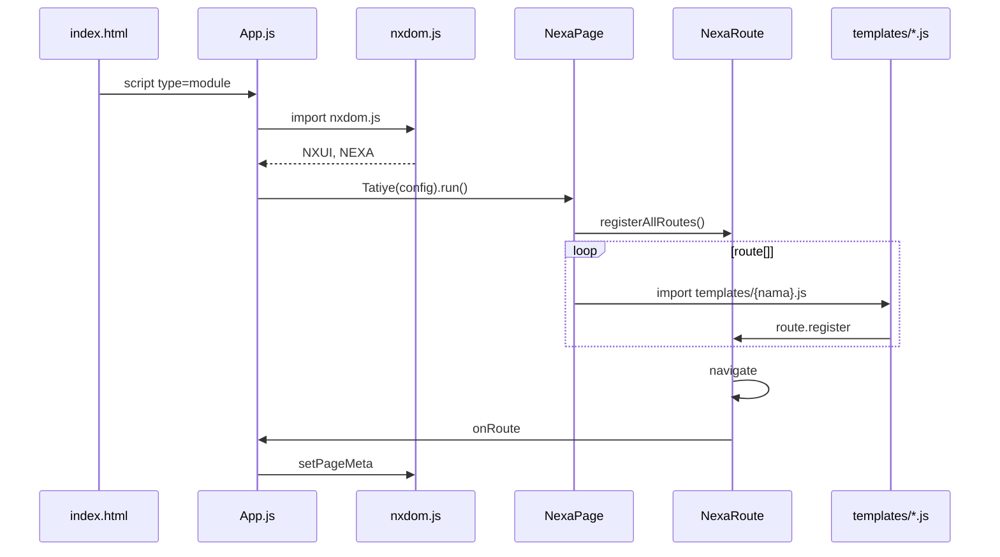
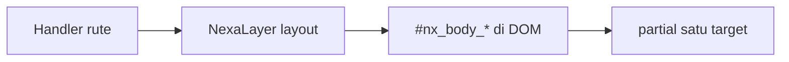

# Nxdom — SPA contoh (`Projects/web`)

Aplikasi **Single Page Application** berbasis modul ES. Entry point: [`App.js`](App.js). Framework UI & routing: **`NXUI`** ([`assets/modules/nxdom.js`](assets/modules/nxdom.js)).

---

## Daftar isi

- [Ringkasan alur](#ringkasan-alur)
- [Prasyarat](#prasyarat)
- [Struktur proyek](#struktur-proyek)
- [Rute terdaftar](#rute-terdaftar)
- [App.js — konfigurasi](#appjs--konfigurasi)
- [config.js & NEXA.endpoint](#configjs--nexaendpoint)
- [Cara kerja routing](#cara-kerja-routing)
- [Menambah halaman](#menambah-halaman-baru)
- [API NXUI (referensi cepat)](#api-nxui-referensi-cepat)
- [Ringkasan: navigasi & refresh](#ringkasan-navigasi--refresh)
- [NXUI.load — navigasi rute](#nxuiload--navigasi-rute)
- [NXUI.Refresh.refresh — reload rute penuh](#nxuirefreshrefresh--reload-rute-penuh)
- [NXUI.Refresh.partial — update satu bagian DOM](#nxuirefreshpartial--update-satu-bagian-dom)
- [partial — mode `html`](#partial--mode-html)
- [partial — mode `render`](#partial--mode-render)
- [partial — mode `update`](#partial--mode-update)
- [partial — `keepScroll` & `#nx_body_*`](#partial--keepscroll--nx_body_)
- [partial — modul `navigation` + `import()`](#partial--modul-navigation--import)
- [partial — event `nxui:partialRefresh`](#partial--event-nxuipartialrefresh)
- [Objek global (window)](#objek-global-window)
- [onRoute & setPageMeta](#onroute--setpagemeta)
- [Web Worker & Service Worker](#web-worker--service-worker)
- [SPA vs PWA di proyek ini](#spa-vs-pwa-di-proyek-ini)
- [Menjalankan lokal](#menjalankan-secara-lokal)
- [Debug & cache](#debug--cache)
- [Keamanan (.htaccess)](#keamanan-htaccess)
- [Referensi file sumber](#referensi-file-sumber)
- [Dokumentasi modul NXUI](#dokumentasi-modul-nxui)
- [Tautan eksternal](#tautan-eksternal)
- [Proyek terkait](#proyek-terkait)
- [Cheat sheet alur](#cheat-sheet-alur)

---

## Ringkasan alur

1. Browser memuat [`index.html`](index.html) → shell (`#main` + nav).
2. [`App.js`](App.js) (ES module) mengimpor [`nxdom.js`](assets/modules/nxdom.js) → `window.NXUI`, `window.NEXA`.
3. `new NXUI.Tatiye({ ... }).run()` → **`NexaPage`** ([`Route/NexaRoute.js`](assets/modules/Route/NexaRoute.js)).
4. **`NexaPage.registerAllRoutes()`** → import [`templates/{nama}.js`](templates/) → `route.register(...)`.
5. **`NexaRoute`** baca URL, render ke `#main`, panggil **`onRoute`** → `NXUI.setPageMeta`.



---

## Prasyarat

| Kebutuhan | Keterangan |
|-----------|------------|
| Server HTTP | Apache (`.htaccess`) atau `php -S`; **bukan** `file://` |
| Browser modern | Dukung ES modules (`import` / `export`) |
| DocumentRoot | Folder ini (`D:\Projects\web`) — host contoh: `http://devweb` |
| Backend (opsional) | Nexa API di `urlApi` jika pakai `Storage().package()` |

---

## Struktur proyek

```
Projects/web/
├── index.html          # Shell + nav
├── App.js              # Konfigurasi SPA (entry)
├── config.js           # Endpoint → NEXA.*
├── README.md           # Dokumen ini
├── .htaccess           # Rewrite SPA + proteksi App.js (Apache)
├── sw.js               # Service Worker (opsional, root)
├── assets/
│   ├── css/style.css
│   ├── images/
│   └── modules/
│       ├── nxdom.js    # Bundle NXUI
│       ├── nexa.css
│       ├── Route/      # NexaRoute, NexaPage, setPageMeta
│       ├── Buckets/    # Storage, fetch, IndexedDB
│       └── …           # Komponen UI (forms, modal, …)
└── templates/          # Handler per rute (appRoot)
    ├── beranda.js
    ├── about.js
    ├── blog.js
```

---

## Rute terdaftar

Dua cara mendaftarkan halaman. **Mulai dari mode manual** (eksplisit di `App.js`); **autoload** opsional jika tidak ingin menulis setiap nama rute.

### Mode manual (`App.js`) — default

Setiap string di array **`route`** didaftarkan saat startup lewat [`NexaPage.registerAllRoutes()`](assets/modules/Route/NexaRoute.js) → `contentIndex()` meng-`import` modul template.

```js
route: ["beranda", "about", "blog"],
```

| Rute URL | File template | Export function |
|----------|---------------|-----------------|
| `/beranda` | [`templates/beranda.js`](templates/beranda.js) | `beranda` |
| `/about` | [`templates/about.js`](templates/about.js) | `about` |
| `/blog` | [`templates/blog.js`](templates/blog.js) | `blog` |
| `/` | — | Redirect ke rute pertama atau **last route** (IndexedDB) |

**Konvensi wajib:**

1. Nama di `route` = nama file tanpa `.js` (kecuali rute bersarang, lihat bawah).
2. Di file template: `export async function {nama}(page, route)` lalu `route.register(page, handler)`.
3. **`page`** yang dikirim ke export = string yang sama dengan entri di `route` (mis. `"beranda"`).
4. Tautan di [`index.html`](index.html): `<a href="/about">About</a>` — [`NexaRoute`](assets/modules/Route/NexaRoute.js) mencegat klik jika rute terdaftar.

**Rute bersarang (manual):** `"contact/data"` → file [`templates/contact/data.js`](templates/contact/data.js), export `contact_data` (`/` → `_`).

```js
// App.js
route: ["beranda", "contact/data"],

// templates/contact/data.js
export async function contact_data(page, route) {
  route.register(page, async (routeName, container, routeMeta, style, nav) => {
    /* … */
  });
}
```

**Sub-rute dinamis** (mis. `/blog/{slug}`): satu entri `"blog"` di `route`; handler memakai `nav.subRoute` + `NXUI.findBySlug` — lihat [`templates/blog.js`](templates/blog.js).

Navigasi contoh: [`index.html`](index.html) (`/beranda`, `/about`, `/blog`, …).

---

### Mode autoload (opsional)

Setelah paham mode manual, Anda bisa menambah token **`"autoload"`** supaya rute lain dimuat dari disk **tanpa** menulis nama di `App.js` (lihat tabel di bawah).

Tambahkan token **`"autoload"`** di `route` (boleh digabung dengan rute eksplisit):

```js
route: ["beranda", "autoload"],
```

Saat pengguna membuka `/data`, [`NexaRoute`](assets/modules/Route/NexaRoute.js) otomatis `import` [`templates/data.js`](templates/data.js) jika ada `export async function data`. **Tidak ada** `routes.manifest.json`, PHP, atau daftar nama di file lain.

| Rute URL | File | Syarat |
|----------|------|--------|
| `/beranda` | `templates/beranda.js` | Bisa eksplisit di `route` **atau** hanya lewat URL jika autoload aktif |
| `/data` | `templates/data.js` | `export async function data` — cukup buat file + link `/data` |
| `/about`, `/blog` | `templates/about.js`, `blog.js` | Autoload saat navigasi jika tidak ada di `route` |

Contoh gabungan: `route: ["beranda", "autoload"]` — **beranda** terdaftar manual; **about**, **blog**, **data** lewat autoload.

#### Autoload + URL bertingkat (subRoute)

Autoload tidak membutuhkan satu file per segmen URL. [`NexaRoute`](assets/modules/Route/NexaRoute.js) mencari **file template terpanjang yang cocok**, sisanya jadi **subRoute**.

| URL di browser | File yang dimuat | Export | subRoute (sisa path) |
|----------------|------------------|--------|----------------------|
| `/page/contoh/v1/token/dll` | [`templates/page/contoh.js`](templates/page/contoh.js) | `page_contoh` | `v1/token/dll` |
| `/docs/panduan/bab-1` | `templates/docs/panduan.js` | `docs_panduan` | `bab-1` |

Aturan:

1. **File** mengikuti path dasar: `templates/{segment1}/{segment2}.js` untuk rute dasar `segment1/segment2`.
2. **Export** = path dengan `/` diganti `_` → `page/contoh` → `export async function page_contoh`.
3. **`route.register(page, …)`** — gunakan parameter `page` dari modul (sama dengan path dasar, mis. `"page/contoh"`).
4. Di handler, **`routeName`** = path penuh (`page/contoh/v1/token/dll`); **`nav.subRoute`** = sisa setelah path dasar (`v1/token/dll`) — cocok untuk versi, token, slug, dll.

Contoh link di [`index.html`](index.html):

```html
<a href="/page/contoh/v1/token/dll">contoh</a>
```

Contoh minimal di [`templates/page/contoh.js`](templates/page/contoh.js):

```js
export async function page_contoh(page, route) {
  route.register(page, async (routeName, container, routeMeta, style, nav = {}) => {
    const sub = nav.subRoute || ""; // "v1/token/dll"
    container.innerHTML = `<p>Rute: ${routeName}</p><p>Sub: ${sub}</p>`;
  });
}
```

Autoload mencoba import dari path terpanjang ke terpendek sampai file ada — **bukan** `templates/page/contoh/v1/token/dll.js`.

---

## `App.js` — konfigurasi

```js
import "./assets/modules/nxdom.js";
import config from "./config.js";

new NXUI.Tatiye({
  endpoint: config,
  containerId: "main",
  mountPath: "",
  appRoot: "templates",
  route: ["beranda", "autoload"],
  defaultRouteMeta: { title: "App", description: "…" },
  debugRouteErrors: true,
  spinner: { enabled: true, centerScreen: true, type: "overlay", … },
  webWorker: { enabled: true, storage: true, indexedDB: true, … },
  serviceWorker: { enabled: true, scriptUrl: "/sw.js", scope: "/" },
  pwa: { enabled: true, manifestUrl: "/manifest.webmanifest", themeColor: "#CB2F2F" },
  onRoute: (routeInfo) => { NXUI.setPageMeta({ … }); },
}).run();
```

### `NXUI.Tatiye` vs `NexaPage`

| Kelas | Peran |
|-------|--------|
| `NexaTatiye` | Wrapper: `.run()` → `new NexaPage(config)` |
| `NexaPage` | Set `window.nexaPage`, sync `NEXA.url`, `registerAllRoutes()` |
| `NexaRoute` | Instance `window.nexaRoute` — URL, history, handler |

### Opsi `App.js`

| Opsi | Fungsi |
|------|--------|
| `endpoint` | Object dari `config.js` → `NEXA.url`, `NEXA.apiBase`, `NEXA.{kunci}` |
| `containerId` | ID elemen render (default `main`) |
| `mountPath` | Prefix URL subfolder SPA (kosong = root) |
| `appRoot` | Folder template relatif root proyek (`templates`) |
| `route` | Array string, `{ route, template }`, atau `["autoload"]` — lihat [Rute terdaftar](#rute-terdaftar) |
| `subrutes` | Grup sub-rute + `containerId` terpisah (opsional) |
| `defaultRouteMeta` | Fallback title/description SEO |
| `onRoute` | Callback setelah navigasi sukses |
| `debugRouteErrors` | Stack error di UI; atau `?nexaDebug=1` |
| `webWorker` | Fetch API di worker + cache IndexedDB |
| `serviceWorker` | Registrasi [`sw.js`](sw.js) |
| `pwa` | Manifest + banner update SW — lihat [PWA (installable)](#pwa-installable) dan [SPA vs PWA](#spa-vs-pwa-di-proyek-ini) |

---

## `config.js` & `NEXA.endpoint`

[`config.js`](config.js) diekspor ke `App.js` sebagai `endpoint`:

```js
const config = {
  url: "http://devweb",           // NEXA.url
  urlApi: "http://localhost/api", // NEXA.apiBase — perbaiki jika masih "localhost:/api"
  drive: "http://localhost/assets/drive",
  typicode: "https://jsonplaceholder.typicode.com/photos?_limit=5",
  firebaseConfig: false,
};
export default config;
```

| Kunci `config` | Setelah init | Pemakaian contoh |
|----------------|--------------|------------------|
| `url` | `NEXA.url` | Origin app / basis path |
| `urlApi` | `NEXA.apiBase` | `Storage().api()`, `Storage().package()` |
| `drive` | `NEXA.drive` | URL asset drive backend |
| `typicode` | `NEXA.typicode` | `Storage().get(NEXA.typicode)` di `blog.js` |
| `firebaseConfig` | `NEXA.firebaseConfig` | `Storage().buckets()` Firebase |

Detail pola Storage: [`assets/modules/Buckets/README.md`](assets/modules/Buckets/README.md).

---

## Cara kerja routing

### Pendaftaran

1. `contentIndex()` di [`NexaRoute.js`](assets/modules/Route/NexaRoute.js) meng-`import()` `templates/{route}.js`.
2. URL modul di browser: `/templates/beranda.js` (relatif dari `Route/NexaRoute.js`).
3. Memanggil `export async function beranda(page, route)` → di dalamnya `route.register(page, handler)`.

### URL → rute internal

`getRouteFromUrl()` memakai pathname + `mountPath` + segment pertama `NEXA.url` (jika ada path deploy).

### Sub-rute blog

[`templates/blog.js`](templates/blog.js):

```js
NXUI.createSlug("02/07/2026", item.title, item.id, "berita");
NXUI.findBySlug(list, subRoute, { pubdate: "02/07/2026", prefix: "berita" });
```

---

## Menambah halaman baru

### Manual (disarankan dulu)

1. Tambah `"kontak"` di [`App.js`](App.js) → `route: [..., "kontak"]`.
2. Buat [`templates/kontak.js`](templates/kontak.js) — `export async function kontak(page, route) { … }`.
3. Link di `index.html`: `<a href="/kontak">Kontak</a>`.

### Dengan autoload (opsional)

Jika `route` sudah memuat `"autoload"`:

1. Buat [`templates/kontak.js`](templates/kontak.js) saja.
2. Link `<a href="/kontak">` — **tidak** perlu mengubah `App.js`.

Rute nested / subRoute panjang: lihat [Autoload + URL bertingkat](#autoload--url-bertingkat-subroute).

---

## API NXUI (referensi cepat)

Diekspos dari [`nxdom.js`](assets/modules/nxdom.js) ke `window.NXUI`.

### Navigasi & refresh

| API | Dokumentasi |
|-----|-------------|
| `NXUI.load()` | [NXUI.load — navigasi rute](#nxuiload--navigasi-rute) |
| `NXUI.Refresh.refresh()` | [NXUI.Refresh.refresh](#nxuirefreshrefresh--reload-rute-penuh) |
| `NXUI.Refresh.partial()` | [NXUI.Refresh.partial](#nxuirefreshpartial--update-satu-bagian-dom) |

Tabel perbandingan: [Ringkasan: navigasi & refresh](#ringkasan-navigasi--refresh).

### Data & HTTP

| API | Contoh | Dokumentasi |
|-----|--------|-------------|
| `NXUI.Storage()` | `Storage().get(NEXA.typicode)` | [Buckets/README.md](assets/modules/Buckets/README.md) |
| | `Storage().api("row", body)` | POST ke `NEXA.apiBase` |
| | `Storage().package().method()` | Chain ke controller PHP |
| `NXUI.getDb()` | IndexedDB Nexa | Dipakai route + cache |

### Slug (URL artikel)

| API | Contoh |
|-----|--------|
| `NXUI.createSlug(pubdate, title, id, prefix)` | Link `/blog/2026/02/07/judul` |
| `NXUI.findBySlug(list, slug, { pubdate, prefix, titleKey, idKey })` | Resolve subRoute |
| `NXUI.parseSlug(slug)` | Judul dari slug |
| `NXUI.getSlugId(slug, prefix)` | ID dari storage slug |

### Meta & DOM

| API | Keterangan |
|-----|------------|
| `NXUI.setPageMeta(opts)` | Title, description, OG, Twitter — lihat [setPageMeta.js](assets/modules/Route/setPageMeta.js) |
| `NXUI.htmlDom()` / `NexaHtml()` | Load template HTML server |
| `NXUI.NexaDom()` | Builder DOM chaining |

### Event

| Event | Kapan |
|-------|--------|
| `nxuiReady` | NXUI siap |
| `nexaRouteReady` | `window.nexaRoute` siap |
| `nxui:routeChange` | Setelah ganti rute (internal NexaRoute) |
| `nxui:partialRefresh` | Setelah `Refresh.partial` sukses (`detail.target`, `detail.element`) |

---

## Ringkasan: navigasi & refresh

Empat cara berbeda mengubah tampilan. **Jangan disamakan.**

| | **NXUI.load** | **Refresh.refresh** | **Refresh.partial** | **refresh `hard: true`** |
|--|---------------|---------------------|---------------------|-------------------------|
| **Fungsi** | Pindah ke rute lain | Jalankan ulang handler rute yang sama | Ganti isi **satu** elemen DOM | Reload tab browser (F5) |
| **URL** | Berubah | Umumnya sama | Tidak berubah | Reload penuh |
| **Handler template** | Rute tujuan dijalankan | Rute aktif / `options.route` dijalankan ulang | **Tidak** dijalankan | Semua dari awal |
| **`onRoute` / meta** | Ya | Ya | Tidak (kecuali panggil manual) | Ya (load halaman) |
| **State form / scroll** | Reset di `#main` | Reset di `#main` | Hanya di dalam `target` | Semua hilang |
| **Kapan dipakai** | Menu, link programatik | Setelah simpan butuh ulang seluruh halaman rute | Sidebar, list, kolom `nx_body_*` | Debug / putus total SPA |

Implementasi: [`nxdom.js`](assets/modules/nxdom.js) → `NXUI.Refresh` / `NXUI.load` → [`NexaRoute.js`](assets/modules/Route/NexaRoute.js).

---

## NXUI.load — navigasi rute

**Bukan refresh.** Memanggil `nexaRoute.navigate(route, pushState)`.

```js
await NXUI.load("blog");
await NXUI.load("beranda", false); // pushState: false → replace history
```

| Parameter | Default | Arti |
|-----------|---------|------|
| `route` | wajib | String tanpa `/` depan, mis. `"blog"`, `"contact/data"` |
| `pushState` | `true` | `false` = tidak menambah entri history |

| Perilaku | Keterangan |
|----------|------------|
| Rute sama tanpa refresh | `navigate()` **no-op** — klik menu aktif di router memakai `refresh()` internal |
| Rute belum terdaftar | Menunggu handler (sampai ~5 detik) atau gagal diam-diam |
| `nexaRoute` belum ada | Warning `[NXUI.load] nexaRoute belum siap` |

**Dokumentasi terkait:** [Cara kerja routing](#cara-kerja-routing), [Rute terdaftar](#rute-terdaftar).

---

## NXUI.Refresh.refresh — reload rute penuh

Memuat ulang **seluruh view rute** lewat `nexaRoute.refresh()` → `navigate()` penuh ([`NexaRoute.js`](assets/modules/Route/NexaRoute.js) ~1320).

**Bukan** refresh ringan satu panel. Untuk satu bagian DOM pakai [Refresh.partial](#nxuirefreshpartial--update-satu-bagian-dom).

### Alur internal

1. `currentRoute` di-set `null` (lolos guard “rute sama”).
2. Handler template dijalankan dari awal (spinner, fetch, isi `#main`).
3. `onRoute` di [`App.js`](App.js) → `NXUI.setPageMeta`.
4. History / IndexedDB last route ikut terupdate.

### Opsi

| Opsi | Default | Arti |
|------|---------|------|
| `route` | rute aktif | Reload rute lain tanpa `load()` dulu |
| `pushState` | `false` | `true` = tambah history tiap refresh |
| `hard` | `false` | `true` = `window.location.reload()` |

### Contoh

```js
await NXUI.Refresh.refresh();
await NXUI.Refresh.refresh({ route: "blog" });
await NXUI.Refresh.refresh({ hard: true });
```

### Risiko

| Risiko | Penjelasan |
|--------|------------|
| State UI hilang | Form, modal, Select2 di `#main` |
| Fetch API ulang | Semua `Storage().get` di template |
| Worker cache | Respons cache SWR bisa membingungkan saat debug |
| Tanpa efek | `nexaRoute` belum siap → hanya warning |
| Loop | `refresh()` di dalam handler tanpa guard |

### Kapan dipakai / hindari

| ✅ Pakai jika | ❌ Hindari jika |
|-------------|----------------|
| Memang perlu ulang seluruh halaman rute | Hanya sidebar / list / satu kolom berubah |
| Setelah mutasi besar yang mengubah layout penuh | Di `setInterval`, `oninput`, loop |

---

## NXUI.Refresh.partial — update satu bagian DOM

Hanya mengganti isi **satu node** (`target`). Tidak `navigate`, tidak handler rute penuh, tidak `onRoute` otomatis.

Sumber: [`nxdom.js`](assets/modules/nxdom.js) ~1289.

### Parameter umum (semua mode)

| Opsi | Wajib | Default | Keterangan |
|------|-------|---------|------------|
| `target` | **Ya** | — | `#nx_body_navigation` atau `Element` |
| `scope` | Tidak | `#main` | Akar pencarian. `null`/`false` = seluruh `document` |
| `keepScroll` | Tidak | `false` | Lihat [partial — keepScroll](#partial--keepscroll--nx_body_) |
| `event` | Tidak | `true` | Lihat [partial — event](#partial--event-nxuipartialrefresh) |

Pilih **satu mode isi** di bawah: `html`, `render`, atau `update`.

### Pencarian elemen (`scope` + `target`)

1. `target` `#id` → cari di dalam `scope`, lalu `getElementById` global.
2. Selector lain → `querySelector` di `scope` atau `document`.
3. Elemen **harus sudah ada** (setelah `NexaLayer` / layout pertama).

---

## partial — mode `html`

String HTML langsung; `el.innerHTML = html`.

```js
await NXUI.Refresh.partial({
  scope: "#main",
  target: "#blog-list",
  html: "<p>Memuat…</p>",
});
```

| | |
|--|--|
| **Cocok untuk** | Placeholder singkat, skeleton loading |
| **Tidak cocok untuk** | Logic async, import modul, tree kompleks |

---

## partial — mode `render`

Fungsi async mengembalikan konten baru.

```js
await NXUI.Refresh.partial({
  target: "#blog-list",
  render: async () => {
    const items = await NXUI.Storage().get(NEXA.typicode);
    return items.map((i) => `<article>${i.title}</article>`).join("");
  },
});
```

| Return `render()` | Perilaku |
|-------------------|----------|
| `string` | `innerHTML` |
| `Element` | `replaceChildren(element)` |
| `DocumentFragment` | `replaceChildren(fragment)` |
| lain / `undefined` | Warning, DOM tidak berubah |

Error di `render` → dilempar lagi (`try/catch` di pemanggil).

| | |
|--|--|
| **Cocok untuk** | Fetch data, HTML dinamis, `import()` modul |
| **Paling sering dipakai** | Panel navigasi, daftar blog, kolom konten |

---

## partial — mode `update`

Mutasi DOM yang sudah ada; **tidak** mengganti `innerHTML` otomatis.

```js
await NXUI.Refresh.partial({
  target: "#nx_body_form",
  update: async (el) => {
    const input = el.querySelector('[name="title"]');
    if (input) input.value = "Judul baru";
  },
});
```

| | |
|--|--|
| **Cocok untuk** | Ubah satu field, toggle class, init plugin pada node yang sama |
| **Tidak cocok untuk** | Ganti seluruh isi panel dengan HTML baru (pakai `render` atau `html`) |

---

## partial — `keepScroll` & `#nx_body_*`

[`NexaLayer`](assets/modules/cards/NexaLayer.js): `row.id: "navigation"` → **`#nx_body_navigation`**.

```js
await NXUI.Refresh.partial({
  scope: "#main",
  target: "#nx_body_content",
  keepScroll: true,
  render: async () => buildMainHtml(),
});
```

`keepScroll: true` menyimpan `scrollTop` kolom `nx_body_*` **lain** di dalam `scope` agar tidak loncat.

---

## partial — modul `navigation` + `import()`

Hanya panel navigasi di-render ulang; logika di file terpisah.

```js
await NXUI.Refresh.partial({
  scope: "#main",
  target: "#nx_body_navigation",
  render: async () => {
    const { navigation } = await import("/assets/modules/tree/navigation.js");
    return await navigation();
  },
});
```

Modul: [`assets/modules/tree/navigation.js`](assets/modules/tree/navigation.js) — `navigation(data?)` → string HTML.

**Path `import()`** relatif ke **file template**, bukan `App.js`:

| File pemanggil | `import("../navigation.js")` → |
|----------------|--------------------------------|
| `templates/workspace.js` | `/navigation.js` |
| `templates/foo/bar.js` | `/templates/navigation.js` |

Disarankan path absolut: `/assets/modules/tree/navigation.js`.

| Argumen `navigation(data)` | Fungsi |
|----------------------------|--------|
| `menuData` | Array menu |
| `treeState.openBranches` | Merge state tree (`NXUI.ref`) |

---

## partial — event `nxui:partialRefresh`

Setelah sukses (jika `event !== false`):

```js
window.addEventListener("nxui:partialRefresh", (e) => {
  const { target, element } = e.detail || {};
  if (target === "#nx_body_navigation") {
    // init Select2, fokus, dll.
  }
});
```

`event: false` — tidak dispatch event.

### Kesalahan umum (partial)

| Masalah | Penyebab |
|---------|----------|
| `elemen tidak ditemukan` | `target` salah / layout belum ada |
| Import 404 | Path `import()` salah |
| Plugin mati | Init ulang di event atau akhir `render` |
| Scroll loncat | `keepScroll: true` |
| Meta tidak berubah | Normal; panggil `setPageMeta` manual |

### Urutan layout + partial



---

## Objek global (`window`)

| Global | Set oleh | Isi singkat |
|--------|----------|-------------|
| `NXUI` | `nxdom.js` | API publik (Storage, load, slug, …) |
| `NEXA` | `nxdom.js` + `NexaPage` | `url`, `apiBase`, `endpoint`, kunci dari `config` |
| `nexaRoute` | `NexaRoute` / `NexaPage` | Router aktif; `.routes` = Map handler |
| `nexaPage` | `NexaPage` | Salinan config: `registeredRoutes`, `mountPath`, `appRoot` |
| `nexaSubRoute` | `NexaPage` (jika `subrutes`) | Router container kedua |

Cek di konsol:

```js
window.nexaRoute?.routes?.keys?.();
window.nexaPage?.registeredRoutes;
NEXA.url;
NEXA.apiBase;
```

---

## onRoute & setPageMeta

### Bentuk `routeInfo` (callback `onRoute`)

| Field | Sumber |
|-------|--------|
| `routeInfo.route` / nama rute aktif | NexaRoute |
| `routeInfo.routeMeta` | `route.routeMetaByRoute` dari template |
| `routeInfo.defaultRouteMeta` | Dari `App.js` `defaultRouteMeta` |

Contoh di [`App.js`](App.js): merge meta lalu `NXUI.setPageMeta({ appName, title, description, ogUrl, canonical, ogImage })`.

### Opsi `setPageMeta` (utama)

Lihat JSDoc di [`assets/modules/Route/setPageMeta.js`](assets/modules/Route/setPageMeta.js).

| Opsi | Default / catatan |
|------|-------------------|
| `title` | `<title>`, `og:title`, Twitter |
| `description` | meta, OG, Twitter |
| `keywords` | meta keywords |
| `appName` | author, `og:site_name` |
| `canonical` | `<link rel="canonical">` |
| `ogImage` | URL absolut disarankan |
| `ogUrl` | Biasanya `location.href` |
| `robots` | `"index, follow"` |
| `themeColor` | `#2563eb` |

**OG cache:** Perubahan di tab browser ≠ cache WhatsApp/Facebook. Scrape ulang lewat [Sharing Debugger](https://developers.facebook.com/tools/debug/).

---

## Web Worker & Service Worker

### Web Worker (`App.js` → `webWorker`)

| Flag | Fungsi |
|------|--------|
| `enabled` | Aktifkan worker fetch |
| `storage` | Fetch lewat worker untuk Storage |
| `indexedDB` | Cache SWR respons API di IndexedDB |
| `storageCacheTtlMs` | TTL cache (ms) |
| `debug` | Log `[NexaWorker]` |

Query uji: `?nexaWorkerDebug=1`.

### Service Worker ([`sw.js`](sw.js))

| `serviceWorker` di App.js | Perilaku |
|---------------------------|----------|
| `enabled: false` | SW tidak terdaftar |
| `enabled: true` | Cache static, GET API, fallback `index.html` navigasi, precache shell |

Registrasi: `NXUI.initNexaServiceWorker(config)` dari `NexaPage`.

### SPA vs PWA di proyek ini

Proyek ini **selalu SPA** (Single Page Application): satu [`index.html`](index.html), rute di browser lewat [`NexaRoute`](assets/modules/Route/NexaRoute.js) + [`App.js`](App.js) (`route`, `autoload`, template `.js`). Mengaktifkan worker **tidak** mengubah itu menjadi “bukan SPA”.

| Lapisan | Apa itu di sini | File / config |
|---------|----------------|---------------|
| **SPA** | Navigasi tanpa reload penuh; konten di `#main` | `NexaRoute`, `templates/*.js` |
| **Web Worker** | Fetch/cache API di thread terpisah (performa) | `webWorker` di `App.js` — **bukan** syarat PWA |
| **Service Worker** | Cache offline, fallback navigasi ke `index.html` | [`sw.js`](sw.js), `serviceWorker` di `App.js` |
| **PWA (installable)** | Bisa “pasang aplikasi” + tampilan standalone | [`manifest.webmanifest`](manifest.webmanifest), `pwa` di `App.js` |

```text
SPA (inti)  →  routing + template
     +
webWorker   →  opsional, mempercepat Storage/API
     +
serviceWorker + manifest (pwa)  →  opsional, perilaku mirip app terpasang
```

**Yang tidak otomatis:** menambah `serviceWorker: { enabled: true }` saja **belum** membuat PWA penuh — masih perlu manifest valid, ikon, dan (di produksi) **HTTPS**. Tanpa manifest, browser tidak menawarkan “Install app” meskipun SW aktif.

**Background sync:** `serviceWorker.backgroundSync: true` hanya menyiapkan event `nexaBackgroundSync` dari SW; logika kirim ulang data offline Anda tulis sendiri (mis. panggil `NXUI.registerNexaBackgroundSync()` setelah gagal simpan).

### PWA (installable)

| File / config | Fungsi |
|---------------|--------|
| [`manifest.webmanifest`](manifest.webmanifest) | Nama app, ikon, `start_url`, `display: standalone` |
| [`index.html`](index.html) | `<link rel="manifest">`, `theme-color`, `apple-touch-icon` |
| `pwa` di [`App.js`](App.js) | `NXUI.initNexaPwa` — banner “Versi baru” saat SW update |
| [`assets/modules/Pwa/NexaPwa.js`](assets/modules/Pwa/NexaPwa.js) | Helper manifest meta + update watcher |

```js
pwa: {
  enabled: true,
  manifestUrl: "/manifest.webmanifest",
  themeColor: "#CB2F2F",
  promptUpdate: true,
},
```

**Uji:** Chrome DevTools → Application → Manifest & Service Workers → Lighthouse PWA. Deploy production butuh **HTTPS**. Ganti `logo.png` dengan ikon 192×192 dan 512×512 untuk hasil install terbaik.

---

## Menjalankan secara lokal

### Apache + virtual host (disarankan)

1. DocumentRoot → `D:\Projects\web`
2. `AllowOverride All`
3. Hosts: `127.0.0.1 devweb`
4. Buka `http://devweb` — samakan `config.url`

### PHP built-in

```bash
cd D:\Projects\web
php -S devweb:80 -t .
```

`.htaccess` tidak dipakai. Untuk router MIME/proteksi seperti proyek Nexa utama, gunakan `system/bin/router.php` dari repo `Tnserver/www` jika tersedia.

### Yang tidak didukung

- `file://` — modul ES gagal
- DocumentRoot salah — `App.js` / `templates/*.js` 404

---

## Debug & cache

| Gejala | Langkah |
|--------|---------|
| Splash tidak berubah | Network: `App.js`, `nxdom.js`, `/templates/beranda.js` → 200 |
| Handler kosong | `nexaRoute.routes` harus punya kunci rute |
| Error di halaman | `?nexaDebug=1` atau `debugRouteErrors: true` |
| JS lama | Ctrl+F5, Disable cache (DevTools) |
| OG preview lama | FB/LinkedIn debugger scrape ulang |
| Last route mengganggu | Clear site data / hapus IndexedDB `NexaStoreDB` |
| `App.js` 403 | Lihat [Keamanan](#keamanan-htaccess) |

---

## Keamanan (`.htaccess`)

File: [`.htaccess`](.htaccess).

- Rewrite: path bukan file → `index.html` (SPA refresh).
- Opsional: blok akses langsung tab baru ke `App.js` / `Nexa.js` kecuali `Sec-Fetch-Dest: script` atau Referer dev.
- Kredensial API **jangan** hanya di `config.js` klien untuk produksi.

---

## Referensi file sumber

| Topik | File |
|-------|------|
| Entry SPA | [`App.js`](App.js) |
| Endpoint | [`config.js`](config.js) |
| Shell HTML | [`index.html`](index.html) |
| Bundle NXUI | [`assets/modules/nxdom.js`](assets/modules/nxdom.js) |
| Router + Page | [`assets/modules/Route/NexaRoute.js`](assets/modules/Route/NexaRoute.js) |
| Meta head | [`assets/modules/Route/setPageMeta.js`](assets/modules/Route/setPageMeta.js) |
| Import template | `contentIndex()` di `NexaRoute.js` (~baris 2906) |
| Storage / fetch | [`assets/modules/Buckets/NexaStorage.js`](assets/modules/Buckets/NexaStorage.js) |
| Worker client | [`assets/modules/Worker/NexaWorkerClient.js`](assets/modules/Worker/NexaWorkerClient.js) |
| SW | [`sw.js`](sw.js) |
| Registri komponen | [`assets/modules/components.js`](assets/modules/components.js) |
| Demo modul | [`assets/modules/index.html`](assets/modules/index.html) |
| Tree / `navigation()` untuk partial | [`assets/modules/tree/navigation.js`](assets/modules/tree/navigation.js) |
| ID kolom `nx_body_*` | [`assets/modules/cards/NexaLayer.js`](assets/modules/cards/NexaLayer.js) |

---

## Dokumentasi modul NXUI

| Dokumen | Isi |
|---------|-----|
| [`assets/modules/README.md`](assets/modules/README.md) | Indeks modul, `nexa.css`, `components.js` |
| [`assets/modules/Buckets/README.md`](assets/modules/Buckets/README.md) | **`NXUI.Storage()`** — api, package, models, buckets, worker cache |
| [`assets/modules/forms/README.md`](assets/modules/forms/README.md) | Form builder |
| [`assets/modules/modal/README.md`](assets/modules/modal/README.md) | Modal |
| [`assets/modules/cards/README.md`](assets/modules/cards/README.md) | Layer / cards |
| [`assets/modules/buttons/README.md`](assets/modules/buttons/README.md) | Tombol |
| [`assets/modules/native/README.md`](assets/modules/native/README.md) | Native screen |
| [`assets/modules/Kit/README.md`](assets/modules/Kit/README.md) | NexaKit |
| Subfolder `assets/modules/*/README.md` | README per komponen |

Dokumentasi platform (backend PHP, arsitektur): header app → `http://localhost/docs/platform/javascript` (host Nexa utama).

---

## Tautan eksternal

| Sumber | URL |
|--------|-----|
| MDN — JavaScript modules | https://developer.mozilla.org/en-US/docs/Web/JavaScript/Guide/Modules |
| Facebook Sharing Debugger (refresh OG) | https://developers.facebook.com/tools/debug/ |
| LinkedIn Post Inspector | https://www.linkedin.com/post-inspector/ |
| JSONPlaceholder (demo `typicode`) | https://jsonplaceholder.typicode.com/ |

---

## Proyek terkait

| Lokasi | Peran |
|--------|--------|
| `D:\Projects\web` | SPA contoh (repo ini) |
| `C:\Tnserver\www` | Backend Nexa PHP, `system/bin/router.php`, docs `/docs/...` |
| `D:\www\proyek\nxdom` | Sumber / salinan modul nxdom (jika dipakai di toolchain) |

---

## Cheat sheet alur

```
index.html
  └─ App.js
       ├─ import nxdom.js     → NXUI, NEXA
       ├─ import config.js    → endpoint
       └─ NXUI.Tatiye(config).run()
            └─ NexaPage
                 ├─ updateNEXAUrl / syncNexaEndpoints
                 ├─ import templates/{route}.js
                 └─ nexaRoute.navigate(...)
                      └─ onRoute → NXUI.setPageMeta
```

**Konsol (uji — lihat bagian terpisah di atas):**

```js
await NXUI.load("beranda");                    // → NXUI.load
// await NXUI.Refresh.refresh();              // → reload rute penuh
await NXUI.Refresh.partial({                   // → partial + render
  scope: "#main",
  target: "#nx_body_navigation",
  render: async () => {
    const { navigation } = await import("/assets/modules/tree/navigation.js");
    return await navigation();
  },
});
```
